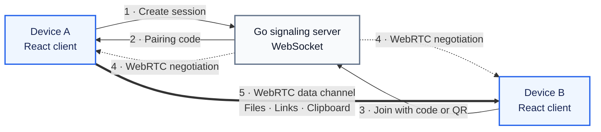

<div align="center">

# PeerToss

### Toss files, links, and clipboard text directly between devices.

Fast peer-to-peer sharing with a QR code or short pairing code—no accounts, database, uploads, or permanent storage.

[](https://github.com/RajanDhamala/peerToss/actions/workflows/deploy.yml)


</div>

## What It Does

PeerToss creates a temporary connection between two browsers. One person opens a session and shares its QR code or pairing code; the other joins and can immediately exchange files, links, and clipboard text.

- **Direct transfer** — shared content travels through a WebRTC data channel.
- **Quick pairing** — connect with a short code or a QR scan.
- **Private by design** — the signaling server cannot read or store transferred content.
- **Zero persistence** — no user accounts, database, or permanent file storage.

## Architecture



The WebSocket server is only the introduction layer: it pairs the devices and passes the information needed to establish WebRTC. Once connected, the encrypted shared payload moves directly between the peers.

## Tech Stack

<p align="center">
  
  
  
  
  
  
</p>

| Layer | Technology | Responsibility |
| --- | --- | --- |
| Web client | React + TypeScript | Pairing UI, QR flow, and sharing experience |
| Signaling | Go + WebSocket | Session coordination and WebRTC negotiation |
| Transfer | WebRTC data channels | Direct peer-to-peer content delivery |

## Run Locally

Start the signaling server:

```bash
cd apps/api
go run ./cmd/api
```

In another terminal, start the web client:

```bash
cd apps/web
pnpm install
pnpm dev
```

## Contributing

Contributions are welcome. Read [CONTRIBUTING.md](CONTRIBUTING.md) for the setup and pull-request checklist.
